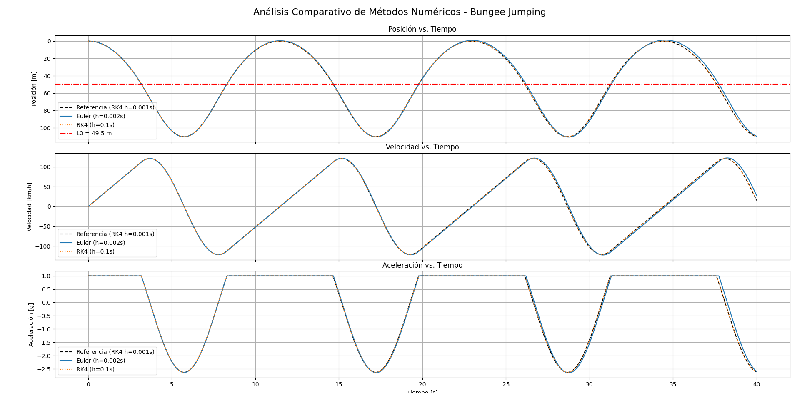
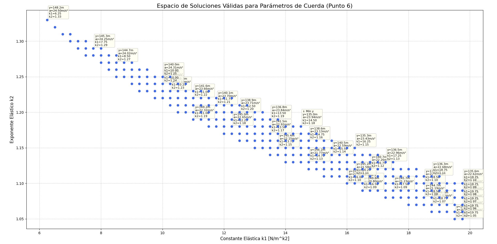
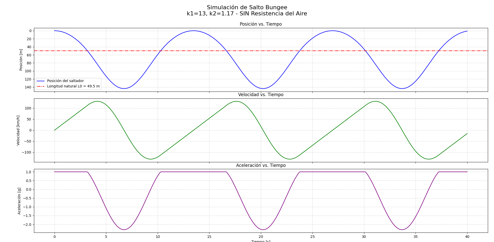
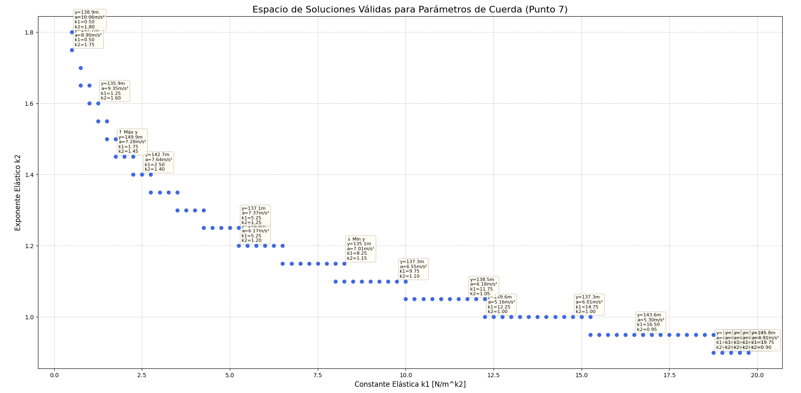
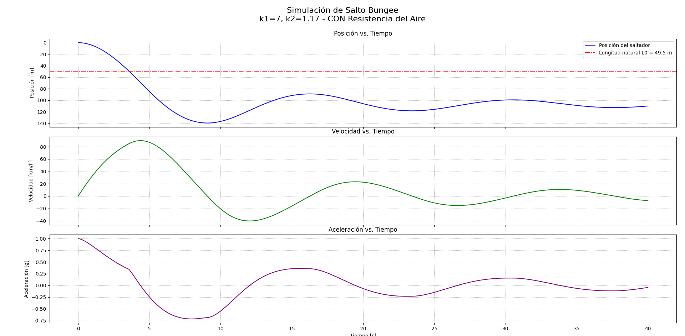

# Trabajo Práctico - Bungee Jumping

**Materia:** Modelación Numérica

**Integrantes:**
*   Tomás Cichero (Padrón: 107973)
*   Valeria Brzoza (Padrón: 107523)

---

## Introducción

En este trabajo práctico, se analiza el comportamiento dinámico de un salto de Bungee Jumping. El objetivo es aplicar métodos numéricos para resolver las ecuaciones de movimiento, comparar los resultados con una solución analítica y utilizar la simulación para diseñar una cuerda que cumpla con ciertos requisitos de seguridad.

---

### Datos Iniciales

Para la resolución, se utilizaron los siguientes datos, calculados a partir del número de padrón `NP = 107973`:

*   **Altura de salto (H):** 150 m
*   **Masa (m):** 81.89 kg
*   **Longitud natural de la cuerda (L0):** 49.46 m
*   **Constante elástica k1 (inicial):** 47.97 N/m
*   **Constante viscosa c1:** 4.59 N(s/m)^c2
*   **Constante viscosa c2:** 1.5
*   **Aceleración de la gravedad (g):** 9.81 m/s²

---

### 1. Modelo Físico y Ecuación de Movimiento

Se establece un sistema de coordenadas vertical con el origen en el punto de salto y sentido positivo hacia abajo. Las fuerzas que actúan sobre el saltador son:

1.  **Fuerza de la Gravedad (`Fg`):** Actúa siempre hacia abajo. `Fg = m * g`
2.  **Fuerza Elástica (`Fe`):** Actúa únicamente cuando la cuerda se estira (`y > L0`) y es de tipo restauradora (hacia arriba). Su magnitud está dada por `Fe = -k1 * (y - L0)^k2`.

Aplicando la Segunda Ley de Newton, la ecuación diferencial que modela el movimiento es:

```
d²y/dt² = g                             (si y <= L0, caída libre)
d²y/dt² = g - (k1/m) * (y - L0)^k2      (si y > L0, actúa la cuerda)
```

---

### 2. Solución Analítica (con k2=1)

**Ecuación de movimiento:**

Para k2=1, la ecuación de movimiento para `y > L0` se convierte en una Ecuación Diferencial Ordinaria (EDO) lineal de segundo orden:

`m · y'' = m · g - k₁(y - L0)`

↓

`m · y'' + k₁ y = m · g + k₁ L0`

**Transformada de Laplace:**

Aplicando la transformada de Laplace y considerando las condiciones iniciales `y(0) = 0` y `y'(0) = 0`, se obtiene:

Fase de caída libre:
```
y(t) = 1/2 gt²
v(t) = y'(t) = gt
```

Fase con cuerda estirada:
```
y(t) = (L0 + mg/k1) - (mg/k1) · cos(ω(t - t0)) + (v0/ω) · sin(ω(t - t0))
t0 = √(2L0/g)
v0 = √(2gL0)
ω = √(k1/m)
```

**Resolución por conservación de la energía:**

Para el caso simplificado donde `k2=1`, el sistema se comporta como un resorte lineal. El punto más bajo de la trayectoria se puede calcular por conservación de la energía, igualando la energía potencial gravitatoria perdida con la energía potencial elástica ganada en el punto de máxima elongación (donde la velocidad es nula).

Energía Potencial Gravitatoria en `y_max`: `E_pg = m · g · y_max`

Energía Potencial Elástica en `y_max`: `E_pe = 0.5 · k1 · (y_max - L0)²`

Igualando ambas energías:

`m · g · y_max = 0.5 · k1 · (y_max - L0)²`

↓

`0.5 · k1 · (y_max - L0)² - m · g · y_max = 0`

Resolviendo la ecuación cuadrática resultante para `y_max`, se obtiene:

**`y_max (analítico) = 110.22 m`**

Este valor servirá como referencia para evaluar la precisión de los métodos numéricos.

---

### 3. Simulación con el Método de Euler

Se resolvió el sistema de ecuaciones diferenciales utilizando el método de Euler, que es un método de primer orden. Para encontrar el punto más bajo con un error menor al 0.1% respecto a la solución analítica, se realizó una búsqueda iterativa del paso de tiempo `h`.

Los resultados, obtenidos del archivo `outputs/punto_3.txt`, muestran que se necesita un paso `h = 0.00156 s` para cumplir con el requisito de error.

Además, se verificó experimentalmente el orden del método, calculando el orden a partir de los errores obtenidos con dos pasos de tiempo distintos. El resultado fue `p ≈ 1.0295`, lo cual confirma que el método de Euler es de primer orden, como se esperaba teóricamente.

---

### 4. Simulación con el Método de Runge-Kutta de Orden 4 (RK4)

Se repitió la simulación utilizando el método de Runge-Kutta de orden 4 (RK4), conocido por ser mucho más preciso que el método de Euler.

La búsqueda del paso de tiempo `h` para un error menor al 0.1% (ver `outputs/punto_4.txt`) arrojó que un paso de `h = 0.25 s` es suficiente. Esto demuestra la mayor eficiencia de RK4, que logra una alta precisión con un paso de tiempo mucho más grande que el de Euler.

La comprobación experimental del orden del método dio como resultado `p ≈ 5.67`, un valor cercano al orden teórico de 4, lo que valida la correcta implementación del algoritmo. La discrepancia puede deberse a la precisión de los datos de error utilizados.

---

### 5. Análisis Comparativo de los Métodos

Para visualizar el comportamiento de los métodos a lo largo del tiempo, se graficaron la posición, velocidad y aceleración para cuatro caídas sucesivas.



*   **Posición vs. Tiempo:** Se observa que la solución de RK4 es prácticamente indistinguible de la analítica en la primera caída. Euler, en cambio, muestra una clara discrepancia. En caídas sucesivas, el error de Euler se acumula, mostrando una ganancia de energía irreal (la amplitud aumenta), mientras que RK4 mantiene una oscilación estable, conservando mucho mejor la energía del sistema.
*   **Velocidad vs. Tiempo:** Los gráficos de velocidad (en km/h) muestran cómo el saltador alcanza la velocidad máxima justo cuando la cuerda comienza a estirarse (`y = L0`).
*   **Aceleración vs. Tiempo:** La aceleración (en g's) es constante e igual a 1g durante la caída libre. Alcanza su valor máximo (en sentido ascendente) en el punto más bajo de la trayectoria, cuando la cuerda ejerce la máxima fuerza.

---

### 6. Diseño de la Cuerda sin Resistencia del Aire

El objetivo de este punto fue encontrar un par de constantes `(k1, k2)` para la cuerda que cumplieran dos condiciones de seguridad:
1.  La profundidad máxima (`y_max`) debe estar entre el 90% y el 100% de la altura total H (135m < y_max < 150m).
2.  La aceleración máxima en el punto más bajo no debe superar los 2.5g.

Utilizando el método RK4 por su precisión, se realizó una búsqueda de parámetros. Los resultados se encuentran en `outputs/punto_6.txt`.

*   **Parámetros encontrados:** `k1 = 8.5` y `k2 = 1.25`
*   **Profundidad máxima alcanzada:** `y_max = 149.78 m`
*   **Aceleración en el punto más bajo:** `a_max = 2.36 g`

Ambos valores cumplen con las condiciones impuestas. Existen múltiples combinaciones de `(k1, k2)` que satisfacen los requisitos, pero este par es uno de los posibles.

En el punto más bajo, la velocidad es cero, pero es el punto de máxima inversión del movimiento. La fuerza elástica de la cuerda hacia arriba es mucho mayor que la fuerza de la gravedad hacia abajo, resultando en una aceleración neta en sentido ascendente.

A continuación se muestra un **mapa de calor que muestra las combinaciones de k1 y k2 que cumplen con las condiciones de seguridad**.



A continuación se muestra la **simulación de la caída con parámetros encontrados sacados del mapa de calor**.



---

### 7. Diseño de la Cuerda con Resistencia del Aire

Se repitió el diseño anterior, pero esta vez incluyendo la fuerza de resistencia del aire, modelada como `F_viscosa = -c1 * |v|^(c2-1) * v`. Esta formulación asegura que la fuerza siempre se oponga a la velocidad.

La resistencia del aire es una fuerza disipativa, es decir, extrae energía del sistema. Por lo tanto, para alcanzar la misma profundidad que en el caso anterior, se necesita una cuerda "más blanda" (con constantes elásticas menores).

Los resultados de la nueva búsqueda de parámetros (ver `outputs/punto_7.txt`) fueron:

*   **Parámetros encontrados:** `k1 = 12.25` y `k2 = 1.0`
*   **Profundidad máxima alcanzada:** `y_max = 149.56 m`
*   **Aceleración en el punto más bajo:** `a_max = 0.53 g`

Se observa que la constante `k1` necesaria es menor que en el caso sin aire, lo cual es coherente con la necesidad de compensar la energía disipada por el rozamiento. Al igual que antes, existen múltiples combinaciones de `(k1, k2)` que cumplen con las condiciones de seguridad.

A continuación se muestra un **mapa de calor que muestra las combinaciones de k1 y k2 que cumplen con las condiciones de seguridad**.



A continuación se muestra la **simulación de la caída con parámetros encontrados sacados del mapa de calor**.



En este último, se observa que la en diferentes caídas sucesivas se pierde energía debido a la resistencia del aire, lo que resulta en una disminución progresiva de la amplitud de las oscilaciones. Esto es consistente con lo observado en la vida real.

---

## Conclusiones

*   **Del Problema Real al Numérico:** Este trabajo práctico ilustra claramente el proceso de modelado en ingeniería. Partimos de un **problema real** (un salto), lo simplificamos a un **modelo matemático** usando ecuaciones diferenciales, y como estas ecuaciones no tenían solución analítica simple, recurrimos a **métodos numéricos** para encontrar una solución aproximada. Cada paso implica supuestos y simplificaciones que alejan el modelo de la realidad, pero que lo hacen manejable.

*   **Utilidad de la Simulación:** Los métodos numéricos demostraron ser herramientas muy poderosas. Nos permitieron:
    *   Resolver un problema físico que no podíamos solucionar con lápiz y papel.
    *   Evaluar y comparar la precisión y eficiencia de diferentes algoritmos (Euler vs. RK4).
    *   Realizar un "diseño virtual", simulando diferentes escenarios para encontrar los parámetros de una cuerda que cumpla con especificaciones de seguridad, algo que sería costoso y peligroso de hacer mediante prueba y error en la realidad.

*   **Conjunto de valores solución para k1 y k2:** En los puntos 6 y 7, encontramos que no existe un único par de valores `(k1, k2)` que cumpla con las condiciones de seguridad (como es lógico). Encontramos un conjunto de soluciones que se pueden visualizar en los mapas de calor. Esto permite elegir diferentes opciones de cuerda que estén dentro de los parámetros seguros.
    *   También nos pareció curiosa la diferencia entre la forma del conjunto solución del punto 6 (sin resistencia del aire) vs. el punto 7 (con resistencia del aire). 
    *   Las soluciones muestran que efectivamente hay una diferencia notable en las constantes elásticas necesarias para cumplir con las mismas condiciones de seguridad cuando se incluye la resistencia del aire.

*   **Experiencias en el desarrollo:** Encontramos varios desafíos, entre ellos obtener rangos adecuados para encontrar las constantes elásticas en los puntos 6 y 7. Hicimos cierta investigación, entre otras cosas descubrimos que el exponente elástico k2 no es parte de la ley de Hooke. Al final lo logramos probando algunos rangos que intuitivamente creíamos que podían funcionar.
